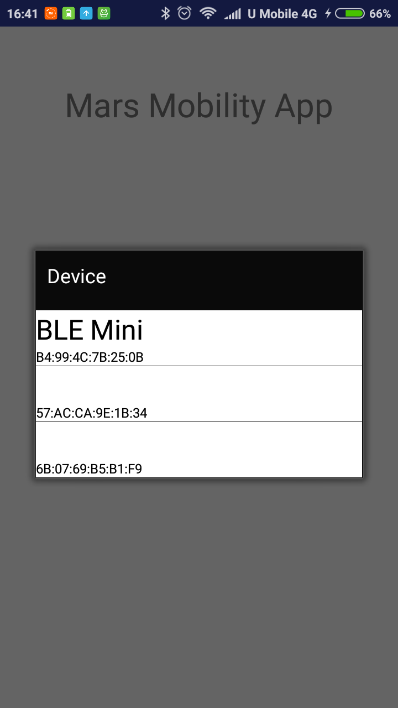
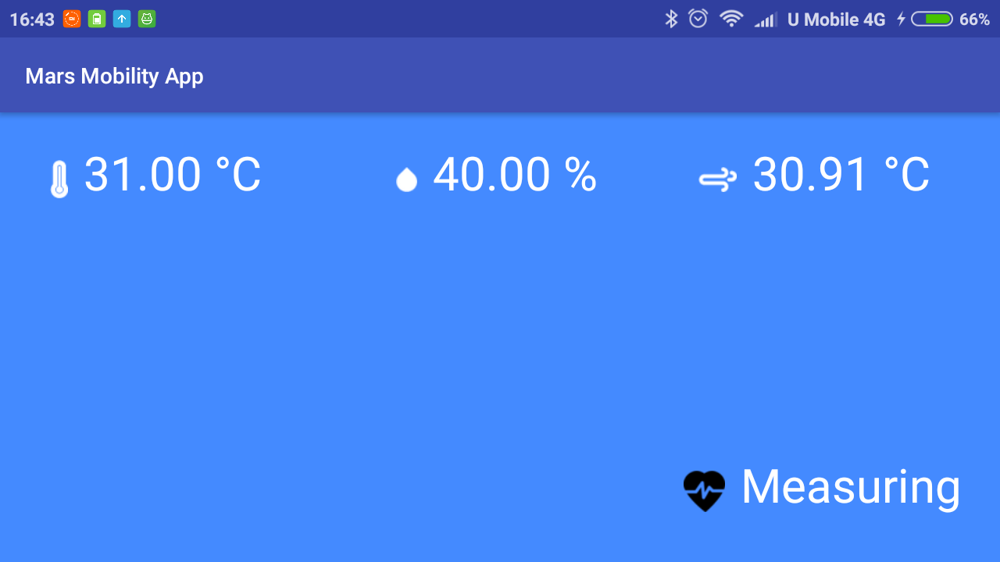

# Mars Mobility App

  
  

  

  

## Getting Started

This is a space application mobile app that displays Temperature, Humidity, Heat Index and Heart Rate to astronaut inside space suit, which developed during [NASA Space Apps Challenge 2018](https://2018.spaceappschallenge.org/). This app is capable of receiving Bluetooth data from [RedBear's BLE Mini](https://redbear.cc/product/retired/ble-mini.html) and alerts astronaut when hazard weather condition is detected.

## Deployment

Tested on Android 6.0 mobile phone.

## Built With

[Android Studio 3.1.3](https://developer.android.com/studio/) 

## Versioning

[Semantic Versioning (SemVer) 2.0.0](http://semver.org/)

## Authors

**Jerry Chong** - [jerrychong25](https://github.com/jerrychong25) 
**Soh Lin Siong** - [sss2sssss](https://github.com/sss2sssss)

## License

This project is licensed under the MIT License - see the [LICENSE.md](LICENSE.md) file for details
